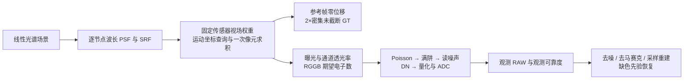

# 新数据目标 review 与作者用途相容的实施方案

审查日期：2026-10-05（Asia/Shanghai）。审查对象：`baolinv0/Jiangtherapee-Super-Resolution-World-Best` 的 `reproduce/jsr-pytorch-engineering`，提交 `0bc29f14dd0e4be8a05cfc5787719203fe43d900`。本文的数值针对该提交；后续修复不得将它们当作新代码的验证结果。

**结论：新增 `post_pixel` 合同是自洽的，建议保留为一个明确的主任务；但数据构造还不足以称为作者训练配方的完整实现。** 本轮没有发现密集输出缩小原生像元、重复面积积分、GT 重抽 PSF 或混入噪声/截断等新增错误。正式训练前，应优先处理运动重采样、PSF 支持和饱和观测可信度，并补等曝光整组缺色的专门验收。

本轮交付为 review、仓库外验证转入的参考脚本与同步后的实施方案；**没有改动训练生成器、模型或正式 recipe**。参考实现证明一种离散场计算方法可行，不是作者未公开的实现，也不是连续相机真值。

## 1. 可复现的 review findings

### P1：运动与面积积分两次插值，会引入依赖帧相位的额外低通

位置：[spectral_data.py 的逐帧渲染](../reproduction/jsr_repro/spectral_data.py#L153) 和 [optics.py 的面积取样](../reproduction/jsr_repro/optics.py)。这是继承的合成近似，不是本次 GT 中心公式的回归。

当前先在 2× 场景网格上 bilinear `_warp`，再卷积，面积积分又 bilinear 查询该网格。对空间不变 PSF 的控制实验，光学与平移可以交换，因此可从同一个光学后离散场直接在偏移坐标积分，避免中间一次重采样。

实测 f/2、pitch 5.76 µm、fill=1、550 nm、位移 0.25 native：在 0.5 cycles/native（原生 Nyquist）正弦上，当前幅度是直接偏移积分的 **0.7499988**；在 0.25 cycles/native 上为 **0.9267774**。位移 0 或 0.5 native 时比值约为 1。因此不同帧多出不同滤波，而参考 GT 没有对应损失。提高面积求积 Q 不能恢复前一步已损失的信息。

这是相对于**同一 piecewise bilinear 场**的差异，不是相对于未知真实连续场的误差。证据：[motion_interpolation.json](google-target-review/motion_interpolation.json)；复现脚本：[diagnose_pixel_optics.py](google-target-review/diagnose_pixel_optics.py)。下面的 coordinate-first 方案在该离散模型中避免此问题，正式实现仍需场景网格收敛。

### P2：允许 PSF 主瓣被支持裁掉后，将很小的旁瓣重新归一化为完整核

位置：[physical_optics.py](../reproduction/jsr_repro/physical_optics.py#L94)。目前仅检查截取核能量大于零，然后归一化；核和为 1 不能证明支持足够。

合法配置 `psf_radius=2, lca_native=2, field_center=[1,1], field_extent=0, f/2, pitch=5.76` 中，700 nm 小支持仅保留 radius16 核能量的 **0.329%**，却仍归一化为 1；质心从约 `(3.987,3.987)` HR 变为 `(0.877,0.877)`。400 nm 同样只保留约 **0.218%**。这些是相对于更大有限支持的能量比例，不能称为绝对连续能量；默认较大支持/较小 LCA 不一定触发这个极端。

应先扩大支持或拒绝该状态，记录归一化前的能量及其参考域，并检查质心、包围能量、二维 OTF。外部核也需记录能量/支持来源。另一次 pupil/FFT 加密比较的核 L1 差约 1–5%，表明归一化和平场测试不足以替代数值收敛。证据：[psf_support_exclusion.json](google-target-review/psf_support_exclusion.json)、[psf_convergence.json](google-target-review/psf_convergence.json)。加密设置本身也不是物理真值。

### P2：满阱截断后加入读噪声，部分截断值又被观测饱和阈值接纳

位置：[physical_sensor.py 的截断及读噪声](../reproduction/jsr_repro/physical_sensor.py#L61) 与 [观测 mask](../reproduction/jsr_repro/physical_sensor.py#L81)。顺序本身合理，但阈值可靠性有边界。

使用现有解析 profile：ISO100、g=4 e/DN、满阱 60000 e、读噪声 3 e；7 帧等曝光、全场 camera RGB=1.4、transmission=`[0.5,1,0.25]`。绿色已全部超过满阱，约 **24.9%** 的绿色观测因读噪声低于阈值而被标为未饱和。ISO200 的同一例子先受 ADC 限制，观测绿色饱和比例为 100%。所以 observed accepted count 不等于真实未截断测量支持。

不能用 clean `signal_saturation` 替换模型 mask。建议根据真实白电平附近的统计标定观测域 guard band 或软可靠度，单独版本化其策略；在噪声模型适用的前提下评估漏判/误拒，保留历史策略以复查旧实验。真值截断标签只用于离线分桶和评价。证据：[full_well_mask_probe.json](google-target-review/full_well_mask_probe.json)（seed2026，native64）；[独立复核](google-target-review/full_well_mask_independent.json)（seed1189，native128）得到约 25.6% 漏判，复现脚本为 [diagnose_full_well_mask.py](google-target-review/diagnose_full_well_mask.py)。在强过曝控制中，clean 标签指期望电子数超阈；Poisson 未触顶的概率极低，但不把这类标签当作一般噪声条件下逐次捕获的精确截断状态。

独立复核的观测域 3σ guard band 降低漏判，但仍留下尾部误接纳；更宽阈值也会拒绝真实未截断的近白电平样本。脚本含隔离读噪声的误拒控制，此控制不含 Poisson，不能代表完整实际相机误拒率。不能将某次有限样本 100% 检出当成永久保证。

### P2：现有 smoke 不能证明跨通道恢复，旧实施计划还与新目标冲突

位置：[google_equal_exposure_smoke.yaml](../configs/google_equal_exposure_smoke.yaml)、[evaluate_transformer.py](../reproduction/jsr_repro/evaluate_transformer.py#L26)，以及旧版训练方案/第一阶段计划。

本轮低亮度等曝光导出样本的真实饱和比例为 0；包围曝光和 `GT>1` 高光指标无法区分“该色有短曝证据”和“整个 burst 缺失该色”。控制实验中相同 GT=1.4、transmission=`[0.5,1,0.25]`：等曝光使整组绿色无支持，校正融合绿色约 1.0；1 EV 包围曝光有三帧未饱和绿色，融合可得到约 1.4。两者总饱和比例约 0.50 与 0.464，不能靠总比例区分。证据：[saturation-protocol-probe.json](google-target-review/saturation-protocol-probe.json)；复现脚本：[diagnose_burst_support.py](google-target-review/diagnose_burst_support.py)（解析 profile ISO800，关闭噪声/量化）。

旧方案要求所有 GT 都对 PSF 不变、未来 v3 使用独立 RNG，与当前 camera-v3 的阶段合同冲突。本轮文档同步将光学不变性限定于 `pre_optics`，并将模型 adapter family 与相机数据协议分开；产品功能仍待实施。

## 2. 选择一个与作者公开用途相容的主任务

**等曝光 RAW burst → 参考帧坐标下、同一光学与原生像元响应后的未截断 2× 密集 camera-linear RGB，即 `post_pixel`。** 保留 `post_optics` 和 `pre_optics` 为独立训练、独立评分的反演消融。包围曝光是另一观测条件，使用同一 GT 合同但另行分桶评价。

依据是用户提供的训练集描述，以及作者原仓库 [README](https://github.com/y-g-jiang/Jiangtherapee-Super-Resolution-World-Best/blob/main/README.md) 公布的 sensor-linear RAW→线性高分辨 RGB、等曝光实拍和像元面积观测实验。这些支持输出颜色/辐射坐标与等曝光用例，**没有公开确定训练 GT 的物理阶段**。作者的 matched-aberration/clear-pupil 评价也不自动等于训练监督；clear-pupil 含衍射，不能等同恒等光学的 `pre_optics`。

[GOOGLE_TARGET.md](GOOGLE_TARGET.md) 已正确区分工程选择与作者事实。本轮请求 Google 官方 PDF、论文页及作者博客均被代理返回 403，未独立核验其中逐页引述；访问限制不是引用错误的证据。该主任务不依赖将 Google 论文解释成精确 GT 公式。

主任务内部至少包含：普通/暗部等曝光、整组一色缺失的等曝光、整组两色缺失、全部截断失败桶；包围曝光另包含同色仍有短曝证据的控制组。某色整个输入及依赖上下文没有测量时，恢复依赖统计先验，光谱多解意味着不能保证任意场景正确。

## 3. 一次坐标求积的具体实现合同

保持波长依赖 PSF，但把**渲染网格密度 S 与输出倍率 2 分开**。设每个视场节点的空间不变核为 `K_iλ`，归一化 SRF 系数为 `s_cλ`，原始光谱场为 `Lλ`。可以预先计算节点 camera-RGB 场：

```text
C_i,c = Σλ s_cλ (K_iλ * Lλ)
F_c(q; u_t) = Σi w_i(q) interp(C_i,c, q + S·u_t)
Y_t,c(j) = mean_(r,s) F_c(q_native(j) + δ_(r,s); u_t)
GT_c(k) = mean_(r,s) F_c(q_dense(k) + δ_(r,s); 0)
```

`w_i(q)` 在**传感器求积位置**取值，不能随场景运动取 `w_i(q+S·u_t)`；一般场变光学不能“先混成一张光学图再整体平移”。完成逐波长卷积后，SRF 积分可与各节点共同的空间查询、传感器权重混合及面积求积交换，因为这些操作在本方案中不依赖波长。**不能把 SRF 移到波长依赖的 PSF 卷积之前**；若采用不同假设，需重新检查。

以场景数组索引表示，一维中心及偏移为：

```text
q_native(j) = m + S·(j+1/2) - 1/2
q_dense(k)  = m + S·(k+1/2)/2 - 1/2
δ_r = ((r+1/2)/Q - 1/2) · S·sqrt(fill)
```

两种中心共用原生像元感光边长 `S·sqrt(fill)`（面积 `S²·fill`）；输出 2× 不缩小 footprint。光谱卷积可以按节点/波段流式处理并累加成 3 通道场，避免在所有帧重复保存 61 波段。正式配置应比较 S=4/8/16、Q、pupil、FFT、支持各自的收敛；选择满足目标频带误差要求的最低成本组合，不能未经检查便称 S=8 充分。提高 S 不会给原 RGB 图片创造真实高频或真实光谱。

四节点的“先在整数点混合再插值”与“在求积点混合插值后的节点场”也不严格相等。因此它是一个新的、明确的 forward model，不承诺相对于旧 v2/v3 逐值 RAW parity。应添加显式 `forward_model` 身份并保留旧路径。**固定 forward model 后，仅切换 GTstage 仍须共享全部 RAW 与 RNG**；改动观测算子时不能继续要求 RAW 不变。

已运行的参考：[coordinate_first_reference.py](google-target-review/coordinate_first_reference.py)、[coordinate_first_results.json](google-target-review/coordinate_first_results.json)。完整 61 波段、4 个 pupil 节点、Canon 5DMarkII 相对 SRF、K7 的 native `[7,3,16,16]` 与 GT `[1,3,32,32]` 均为有限非负值。单节点坐标查询与独立偏移中心积分的最大误差为 0；四节点固定传感器权重的线性斜坡检查误差约 `2.2e-7`，错误地移动已混合光学场为 `0.00193`。native 与**特意对齐中心后的** dense 子集一致，不意味着默认 `GT[...,::2,::2]` 与 native 相等。

参考仍固定 S=2，并未实现 S 可配置或证明场景网格收敛；Q4 对 Q64 的例子最大差约 `0.00149`，Q16 约 `8.8e-5`，只能作为该离散场的求积收敛比较。这些结果支持其可实施性，正式生成器尚未切换。

## 4. 传感器、资产与网络接入



- **资产组合有来源。** 机身模式、ISO、pitch、SRF、PTC、black/white、满阱和镜头状态联合绑定。公开 donor 噪声/随机 pitch/OPD 只标为抽象扩增；没有实测库就不声称覆盖所有全画幅和主流定焦。阶段一可用当前假设把接口做通，标定 anchor 仍是正式验证依赖。
- **通量约定明确。** D65 逐通道归一化 SRF 与额外 transmission 分开，避免重复计算滤光片透过率。归一化 PSF 只控制形状；T-stop/渐晕独立。现有 `electrons_per_reference_unit=(white-black)·gain` 随 ISO 改变，表示逐 ISO 白电平归一化，不能报告成固定入射光子的 ISO 扫描。高填充率的面积归一化也不自动实现绝对 QE/电子预算。
- **GT 与输入使用共同场。** GT 无 CFA、输入 transmission、逐帧曝光、噪声、量化和截断，可以超过 1。观测截断前后状态分开；诊断标签不进网络。
- **网络保持清晰的接口。** 当前 K7 Transformer 可输出未截断 RGB；原 v1 Controller/RefineNet 还需 Dataset/观测 adapter、mask fallback、版本化输出范围和完整档案身份，不能只换 GT。v1 的 LCA 校正若改变输出颜色坐标，必须同步定义 GT 几何，不能去掉模型色偏却仍按未变换的 sensor-coordinate GT 评分。

详细标定资源及待实现接口见同步后的 [TRAINING_DATA_IMPLEMENTATION_PROPOSAL.md](TRAINING_DATA_IMPLEMENTATION_PROPOSAL.md) 和 [第一阶段计划](superpowers/plans/2026-10-05-spectral-jsr-phase1.md)。

## 5. 验收顺序与本轮结果

1. 数值观测：coordinate-first 与独立逐点参考一致；sensor field 不随场景运动；native/dense 同 footprint；收敛分别检验场景密度、PSF/FFT/支持与面积求积。
2. 饱和：先用 ADC-first 的整场一色缺失控制，再加入 FW-first 读噪声压力；分别统计真实截断支持与 observed accepted support，评价 guard band 的漏判和误拒。全部截断/同色异谱反例单独呈现。
3. 学习能力：在自然/实测光谱场景留出集比较校正融合与网络。报告缺失颜色 RMSE、未饱和颜色损伤、色比误差、暗部偏差、周期纹及不同缺失桶；oracle/estimated 几何分开。训练与测试划分按场景/资产状态，不能仅换随机 seed。
4. 兼容性：旧路径可重现；新观测算子身份独立；相同观测下三个阶段逐值 RAW 相同、GT 及 checkpoint 身份不同；按 stage 验证光学/填充率干预。

本轮独立运行：完整套件 **110 passed**；等曝光与 HDR 两套各 **8 步 CPU** 训练、导出、推理及 oracle/estimated 评测完成。环境 Torch 2.14.1+cpu、NumPy 2.4.6，与提交内归档的 Torch 2.5.1 环境不同，不能要求训练指标逐值重现。实测摘要：[validation-summary.json](google-target-review/validation-summary.json)、[pytest.txt](google-target-review/pytest.txt)。

| 本轮 smoke / oracle | 校正融合 PSNR | Transformer PSNR |
|---|---:|---:|
| 低亮度等曝光 | 48.4670 dB | 48.4603 dB |
| HDR 包围曝光 | 21.6250 dB | 21.6163 dB |

这两套短训练未证明质量收益，更未证明整组缺色恢复。它们只支持当前链路可运行；数值观测修正、饱和可靠度策略、完整相机/镜头标定和自然 RAW 质量仍需后续实现与验收。
