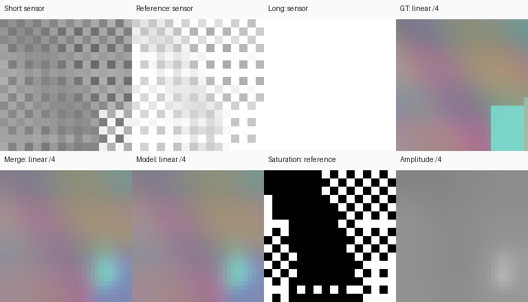

# 七帧 Transformer：讲稿机制的独立工程补齐

日期：2026-10-05。实现标识：`speech-inspired-transformer-v1`。本目录交付可运行的数据、模型、训练、测试和推理链路；**不声称获得作者未公开的 Transformer 原代码、权重、训练集或标定库，也不声称原论文画质复现。**

讲稿依据是用户提供的《SR相机手持超分辨率16bitraw合成讲稿》全文，署名姜尧耕，编辑时间2026-10-03；没有独立取得知乎网页地址。作者公开 GitHub 主分支仍是 [`6ab0f5b`](https://github.com/y-g-jiang/Jiangtherapee-Super-Resolution-World-Best/tree/6ab0f5bf76d2ccfbf7e21798cc575232ef9b272b)。公开 v9.8 release说明后端/权重沿用v9.7：[发布说明](https://github.com/y-g-jiang/Jiangtherapee-Super-Resolution-World-Best/releases/tag/v9.8)。公开 Controller/RefineNet与讲稿里的Transformer应分开识别；版本不同不能直接断定作者前后矛盾。

## 与讲稿是否一致

| 讲稿机制 | 新实现 | 证据与边界 |
|---|---|---|
| 七帧多尺度自注意力、晚收束 | 空间窗口注意力＋逐位置跨帧注意力；三层编码、两层解码均保留七帧 | 保存完整shape trace；头数、宽度、窗口、层数是工程推断 |
| 跨帧差分和跳连 | 与循环前一帧作显式差分卷积；同帧编码/解码跳连 | 单独保留帧轴；没有原作者公式或逐权重对照 |
| PTC/暗场先验参与恢复 | 电子/DN profile、PTC CSV拟合、可选暗场时间方差；同一profile生成RAW与variance输入 | 默认解析profile不是作者实测库；合成拟合测试不能替代相机标定 |
| 局部保边幅度、曝光、饱和指导 | 无量纲边缘权重RMS；校正曝光/透过率；输入variance、饱和、有效与黑位状态 | 原幅度场公式未知；条件增益一致不意味着零色偏 |
| 末端循环配对与两级上采样 | 解码后才7→4→2→1；两次latent PixelShuffle×2 | 配对旋转/门控/unpaired规则明确为推断 |
| 跨颜色共享相位展开 | 共享latent完成相位展开，再做RGB 1×1投影 | 实现该结构概念；未证明所有交错伪影被消除 |
| 七帧0–1档间隔包围曝光 | 参考EV0，其他{-3,-2,-1,+1,+2,+3}×interval；interval∈[0,1] | 顺序为工程约定；0.3间隔对应1.8EV总跨度，1档间隔对应6EV |
| ISO100–800、f/2–f/8、3–5.76μm、大填充率 | 四档ISO解析profile；三波段Airy PSF；像元面积积分、fill_factor0.9–1默认 | 参数范围呼应讲稿；不是覆盖全部全画幅机型/主流定焦镜头的真实库 |
| 不同透过率与通道饱和 | RGB transmission、电子满阱/ADC限制；加噪前信号饱和mask；目标保留>1 | 真正产生过曝，而不是把噪声越界算高光；尚未证明学会可靠跨色高光恢复 |
| 图片“上采样到全光谱” | 三通道linear RGB proxy＋代表波长 | 原词含义不明确；没有高光谱重建，也不把空间放大写成全光谱 |
| 去移动物体鬼影、3090Ti速度、7帧胜所有16帧 | 本工程未验证 | 无动态场景去鬼影、CUDA速度或公平大规模质量对照 |

已有 `inferred-jsr-v1` 流程仍对应公开v9.8模块及推断Tap：[旧版说明](REPRODUCTION.md)。两套checkpoint和入口严格区分；公开NPZ不能用于新Transformer。

## 数据集构造过程

源数据优先使用合法取得的HR图像：DIV2K、Zurich Canon RGB，或者已有线性RGB。源scene先划分train/val/test，再随机裁块；manifest保留scene_id与SHA256，拒绝跨split泄漏与内容变化。DIV2K在本工程采用0001–0800训练、0801–0850验证、0851–0900测试；最后50张是从官方验证集划出的工程测试，不是官方测试集。具体准备方式见 [DATA.md](DATA.md)。

1. 读取float RGB或者做逆sRGB；逆sRGB不能撤销未知tone mapping/锐化/降噪。源图已截断的高光无法恢复成真实GT。CI仅用12个程序生成scene（10 train、1 val、1 test）。
2. 保留PSF/位移边界，裁图、旋转/翻转。源图尺寸不足时明确记录双线性放大。`scene_gain`提供显式HDR场景辐射缩放，可使目标>1；不是声称恢复了源图损失的高光。
3. 在HR网格上对R/G/B分别使用650/550/450nm代表波长的圆孔径Airy强度核：`[2 J1(u)/u]^2`，`u=πr/(λN)`。r用像元间距/2换算成μm，N为f-number。有限核截断后归一化，默认半径12 HR像素；没有实测像差/像场/光谱QE。极窄PSF的离散采样也是近似。
4. **GT是PSF之后、像元积分之前、通道透过率之前的参考线性RGB**，尺寸3×2H×2W，参考白为1，可超过1。
5. 每帧有已知自然手抖平移。native像元中心在HR坐标`(x+.5)*2-.5`；frame(x,y)观察ref(x+dx,y+dy)。对边长`sqrt(fill_factor)*pitch`的像元有效区域做4×4积分求平均，再采RGGB。fill_factor改变空间足迹；总灵敏度已纳入profile，不重复乘进辐射值。
6. 七帧保持同一个ISO/光学profile。逐帧乘曝光比和通道透过率。设`D=white_dn-black_dn`、`g=gain_e_per_dn`、`E=Dg`，光电子期望为`radiance*exposure*transmission*E`。满阱与ADC上限共同给出信号饱和阈值；mask在随机噪声之前生成。
7. 满阱截断期望后生成Poisson光子噪声，加电子域Gaussian读噪声；转DN、加dark offset、ADC截断/可选整DN量化，再扣黑归一化。饱和区噪声属于简化模型，mask会降低其融合可靠性。PRNU、暗电流随曝光变化、完整DSNU校正和坏点图尚未模拟。
8. 由同一profile及观测强度估计variance：`(max(raw,0)*E + read_noise_e²)/E²`，整DN量化时再加`1/(12D²)`。这是部署可计算的plug-in先验，不使用GT噪声方差作弊。负读噪声、黑位越界、信号饱和分开记录。

每个样本返回raw[K,1,H,W]、shifts[K,2]、exposure[K]、transmission[3]、variance/saturation/valid/black_invalid[K,1,H,W]、target[3,2H,2W]。JSON记录源hash、split、seed、ISO、单位、曝光、PSF/像元参数、profile来源与饱和比例。模拟场景边界留有完整观测；模型逆warp的越界则标为无效。

默认解析profile采用ISO100/200/400/800，g为4/2/1/0.5 e/DN、read_noise为3e、black512DN、white16383DN、fullwell60000e；RGB transmission0.70/1.00/0.55。**这些只是可检查单位的代理，不是任何具体相机的测量。**

参考白1对应当前ISO的归一化DN亮度，E随该ISO的gain变化；不是跨ISO固定的物理照度。f-number在这里控制衍射形状，scene_gain/参考曝光指定亮度；没有按固定照度联合推导光圈/快门/ISO的绝对光子预算。这一简化与全光谱光学相机仿真仍有距离。

PTC接口输入CSV列`iso,mean_dn,variance_dn2`，mean为扣黑均值、variance为时间方差，选取未饱和线性区。拟合`slope*mean+intercept`，gain为1/slope；去除1/12 DN²量化方差后换算read noise。可选`--dark`输入同ISO raw-DN[T,H,W]，用逐像素时间方差避免把空间DSNU混进读噪声。一个dark stack只对应一个ISO；多ISO分别拟合后合并已验证profile。black/white/fullwell/transmission需独立提供或明示默认值，不能全部由PTC斜率推得。这里参考[EMVA1288线性模型](https://www.emva.org/wp-content/uploads/EMVA1288Linear_4.0Release.pdf)，**没有宣称完成标准规定的全部测量或标准认证**。

```bash
python -m jsr_repro.calibration --output data/analytic-camera.json
python -m jsr_repro.calibration --csv my-iso100-ptc.csv --dark my-iso100-dark.npy --black-dn 512 --white-dn 16383 --full-well-e 60000 --output data/my-iso100-camera.json
```

profile标识分`analytic_inferred`与`fitted_input`；后者只表示拟合了输入，不能自动升级为独立验证过的实测资料。将其路径写入`data.profile`，并把`data.options.iso`限制到profile实际包含的ISO。

## 模型构造与幅度规则

RGGB打包为R/G1/G2/B四个半分辨率平面。每平面按`-shift/2`逆变换到参考位置；颜色相位由同色平面保留。噪声方差用双线性系数的平方传播，饱和/无效mask按所有非零贡献保守传播；没有建模插值后跨像素噪声相关。

先除曝光与透过率得到参考辐射。独立线性merge排除信号饱和及几何无效观测，产生baseline与局部幅度。全饱和/全无效处只能回退到剩余有效观测均值或0，并输出`all_saturated_or_invalid_packed`标记；这种回退不是可靠高光恢复。

幅度A来自3×3边缘加权能量：邻域与中心的颜色距离除以局部能量，再形成`exp(-4*distance)`权重，对平方能量加权开根号。这个无量纲权重使信号共同放大g时A同倍放大。A=0使用安全分母，并使最后输出0；不用固定亮度epsilon。输入21通道：4辐射/A、4variance/A²、4饱和、4valid、4黑位状态、1 log2曝光。baseline/幅度先聚合观测，不会把神经主干帧轴提前收束。

```text
[B,7,1,H,W] RAW + calibration/exposure/masks
  -> RGGB pack + per-plane inverse translation
  -> exposure/transmission correction, amplitude normalization
  -> [B,7,C,H/2,W/2]
  -> enc0 -> enc1(1/2) -> enc2(1/4), all K=7
  -> dec0 + per-frame skip -> dec1 + per-frame skip, all K=7
  -> cyclic learned pairing 7 -> 4 -> 2 -> 1
  -> shared latent PixelShuffle2 -> PixelShuffle2 -> RGB projection
  -> amplitude restoration + corrected linear baseline
  -> [B,3,2H,2W], unclipped float linear RGB
```

每个exchange block有同帧空间窗口MHA、逐空间位置七帧MHA、与循环前一帧的差分卷积及前馈卷积。晚融合每轮先按1/2/3帧循环旋转，再相邻两两门控混合并学习差分；奇数轮把未配对的最后一帧保留。共享latent完成两级相位展开，之后才投影RGB。以上方程全部是工程选择。

固定几何、曝光、mask，raw×g且variance×g²时可测条件增益等变。真实改变快门会改变噪声、饱和和配准，此时恢复策略仍可能不同。该性质不证明没有暗部色偏或所有纹理都正确。

## 运行、训练与测试

```bash
python -m pip install -e ".[test]"
python -m pytest -q
python -m jsr_repro.validate_transformer --output runs/transformer-verification
```

最后一条离线命令自动构造fixture、训练16步、测试oracle/estimated、保存NPZ与checkpoint、导出float RGB/16bit RGB TIFF/预览，并保存PTC拟合、CPU恢复、较大模型反向和visual index。重复运行使用新输出目录。Windows沙箱如果限制默认Temp/cache，可用`python -m pytest -q -p no:cacheprovider --basetemp runs/fresh-test-temp`；目录必须是新的本工程测试目录。

```bash
python -m jsr_repro.prepare --source /datasets/DIV2K --layout div2k --encoding srgb --output data/train
python -m jsr_repro.train_transformer --config configs/transformer_k7.yaml
python -m jsr_repro.evaluate_transformer --checkpoint runs/transformer-k7/best.pt --manifest data/train/manifest.jsonl --alignment oracle --output runs/transformer-k7/test_oracle.json
python -m jsr_repro.evaluate_transformer --checkpoint runs/transformer-k7/best.pt --manifest data/train/manifest.jsonl --alignment estimated --output runs/transformer-k7/test_estimated.json
```

正式配置width32/heads4/window4、native64、100000步、batch1，仅是可修改的提案；本次没有执行全部自然图像训练。损失在线性域：RGB L1＋0.1色差L1＋0.05梯度L1，GT>1区域再加0.2 L1。AdamW/cosine schedule，clip_grad1。没有声称这是作者配方，也没有把短训改善当收敛证明。

断点恢复使用同配置：`python -m jsr_repro.train_transformer --config configs/transformer_smoke.yaml --stop-after 8`，再加`--resume runs/transformer-smoke/last.pt`；该独立smoke命令需先`prepare --procedural 12 --output data/smoke`。checkpoint保存模型、optimizer、schedule、RNG、step/epoch/cursor、manifest/profile身份；拒绝配置/内容改变。模型与v1 checkpoint不可互换。

评价固定参考辐射白1、同一HR crop，无逐图增益拟合，报告RGB/色差/暗部/高光误差，以及真饱和和全不可用比例。HDR值可>1，所以固定白1的PSNR不能与显示图PSNR直接比较。estimated先扣曝光再做既有绿色FFT全局平移，无法充分处理饱和、遮挡、旋转、局部运动；oracle单独报告。参考相关[DBSR](https://openaccess.thecvf.com/content/CVPR2021/html/Bhat_Deep_Burst_Super-Resolution_CVPR_2021_paper.html)、[Unprocessing](https://openaccess.thecvf.com/content_CVPR_2019/html/Brooks_Unprocessing_Images_for_Learned_Raw_Denoising_CVPR_2019_paper.html)、[Burstormer](https://openaccess.thecvf.com/content/CVPR2023/html/Dudhane_Burstormer_Burst_Image_Restoration_and_Enhancement_Transformer_CVPR_2023_paper.html)，这里的采样、标定和结构不是直接转称这些工作的原实现。

## 推理、真实RAW与16bit含义

```bash
python -m jsr_repro.infer_transformer --checkpoint runs/transformer-verification/training/last.pt --burst runs/transformer-verification/burst.npz --alignment provided --radiance-white 4 --output runs/transformer-result
```

NPZ必需上述8个数值字段及JSON metadata（RGGB、scale2、profile SHA256、profile provenance）。验证脚本通过`bracket_data.save_burst`生成完整归档。已有`import_raw`仍只服务等曝光v1，不能把它的无标定NPZ直接交给Transformer。

真实拍摄必须同相机、同ISO、同光圈/读出、相同裁块/CFA origin，按真实快门比填写exposure并将参考置1；同读出dark/PTC扣黑。用归一化DN估计variance，transmission填写已采用的通道系数，饱和mask按观测ADC/有效满阱边界保守估计，valid由几何支持给出，black_invalid记录黑位越界。真实捕获无法直接访问无噪声饱和状态，mask估计会有误差；本版未验证真实RAW适配。ISO变化的包围曝光、镜头变化和色彩管理都不在该输入契约内。

输出`linear_rgb.npy`保留float32辐射值；`linear_rgb16.tiff`为三通道uint16线性编码：`radiance=uint16/65535*radiance_white`。sidecar写白值和低/高端截断比例。PNG按相同白值做sRGB诊断预览；没有相机WB/CCM。16bit只说明文件精度，不能据此声称恢复16bit有效信息或新增动态范围。CLI有65536 native像素内存限制，需偶数CFA裁块；没有生产级全分辨率分块。

## 实际证据与尚未证明的部分

[验证记录](transformer-validation/validation.json)：Windows CPU16步，width8；12个procedural场景，仅1个test。oracle下merge16.622dB、新模型16.635dB；estimated下分别11.777/11.788dB。高光误差、较差配准和极小样本全部保留；这不是自然图像泛化、原作者效果或SOTA证据。

七帧shape trace、零输出与条件增益、合成PTC拟合、4步连续/2+2断点逐值一致及width32/native32单步反向记录均在[证据目录](transformer-validation/)。width32模型307299参数，不据此声称计算量比论文低一半。原v1的23项测试/32步验证保留；新旧全套测试结果见任务实施报告。



仍需作者完整Transformer定义、原训练场景/划分、“全光谱”算法、真实PTC/暗场/光学库、完整日程与实验输入，才能升级为严格原方法数值复现。正式自然图像训练、真实相机及移动物体测试、RGB色彩校正、完整配准、GPU速度和公平外部baseline都尚未执行。
