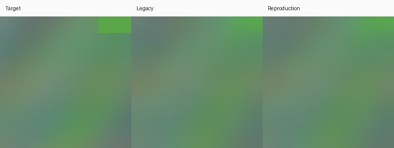

# 实际执行的验证

本文记录最初`inferred-jsr-v1`的23项测试和32步smoke；“未实现多曝光”等条目仅对应该路径。七帧Transformer新增16步验证、物理数据/标定测试及独立审核，见[TRANSFORMER.md](TRANSFORMER.md)、[新证据](transformer-validation/)和[任务实施报告](tasks/zhihu-transformer/IMPLEMENTATION_REPORT.md)。目前已取得用户提供的知乎讲稿全文，未独立取得网页URL。

日期：2026-10-05（Asia/Shanghai）。这是工程验证记录，**不是原论文指标复现或任何SOTA排名**。

## 执行环境与结果

Windows、Python3.11.15、PyTorch2.14.1+cpu、NumPy2.4.6、OpenCV4.14.0。独立WGPU对照使用wgpu0.31.1、Intel HD Graphics620、Vulkan。

| 检查 | 实际结果 |
|---|---|
| 全部自动化测试 | **23 passed**：CFA颜色、采样中心/运动符号、噪声方差、scene/hash隔离、数据确定性、官方前端、官方NPZ、零输入/增益/梯度、严格恢复训练、分阶段初始化、推理与内存限制 |
| 保存/恢复 | CPU同配置连续4步与2步保存+恢复2步的模型权重逐值相同 |
| 正式模块规模 | Controller32、RefineNet116×8，4,156,267参数；K14/native16的一次前向、反向、optimizer step通过，全层梯度有限非零 |
| 端到端smoke | 12个procedural源scene：10 train、1 val、1 test；小模型4/8/2，K4，32步；保存、测试、NPZ推理与预览通过 |
| 条件性响应 | 该常量测试中零输入输出严格0，2^-9至2倍增益的最大relative RMSE为0（FP32该fixture）；不能推广为任意输入精确零误差 |
| 原公开模块数值对照 | K4 Controller、RefineNet residual/factorized均通过；见下表 |

可复跑命令在 [README](REPRODUCTION.md)。完整数值记录见 [validation目录](validation/)。依赖版本见根目录`requirements-validated.txt`。

## 公开模块移植

先校验作者manifest中的SHA256，再在同一输入上比较PyTorch与原WGPU执行器。PyTorch使用erf GELU，原shader为多项式erf近似；使用绝对容差2e−5、相对容差2e−4。

| 模块 | 输入 | 最大绝对误差 |
|---|---|---:|
| K4 Controller | 151×32×32，固定seed1329随机特征 | 7.3761e−6 |
| K4 RefineNet residual | 6×16×16随机双路RGB | 7.4506e−7 |
| K4 RefineNet factorized | 同输入、官方reference amplitude | 7.1526e−7 |

此外，37×39随机phase/legacy上的特征完成、局部RMS与齐次归一化通过与作者NumPy/OpenCV实现的逐值对照。**这些证明已公开模块的数值移植，不能证明独立Tap、配准或新训练与原EXE一致。**

## 保留不利结果

以下仅是**1个held-out procedural场景的一块32×32输出**，固定峰值1、HR裁边4、同一target，不拟合曝光/颜色。模型只有32步训练，数字用于确认评测连通，不能评价自然图像泛化，也不能与论文分数并列。

| 方法 | Oracle平移PSNR | 估计平移PSNR |
|---|---:|---:|
| 单帧bilinear | 40.778 dB | 40.778 dB |
| Legacy融合 | 44.722 dB | 36.864 dB |
| Learned融合 | 43.561 dB | 36.581 dB |
| 本工程最终输出 | 43.707 dB | 36.644 dB |

当前短训输出弱于legacy；估计平移更差。这些结果如实保留，表明简单配准和训练尚需改进，不作为作者原方法优劣的证据。val PSNR从第8步50.555至第32步50.801的变化同样不是充分的训练收敛证据。

## 未执行或不支持的范围

- 未进行公开自然图像全集100000步训练；未训练原作者数据，也未复现原论文数值。
- 未运行真实相机RAW端到端；rawpy接口仅为可选适配器。
- 未验证CUDA训练、手机部署、真实噪声标定、全相机分辨率吞吐或能耗。
- 未复现作者阶梯环、15类像差、九档真实暗部、质量预测器的原始实验；诊断fixtures另行定义。
- 未实现完整光流、LCA补偿、动态场景、多曝光HDR、生产分块推理。
- 未自动运行DBSR/BurstM等外部模型；相应官方数据域/对齐协议在来源文档中列出。
- 未取得可核验的知乎JSR原文，不能将该部分列为已验证来源。

这份PR的完成标准是可审阅的工程补全与诚实的证据边界；不是声称所有研究缺口已被解决。
